# Semaine 1

Nous vous proposons cette semaine quelques exercices sur l’électronique. L’introduction au langage *C* se fera la semaine prochaine. Vous pouvez déjà faire quelques pas en programmation en suivant le premier volet de nos exercices :

- Pour *Arduino* :  [LC1.pdf](http://www.didel.com/coursera/LC1.pdf)
- Pour *Energia/MSP430* : [LC1-msp.pdf](http://pyr.ch/coursera/LC1-msp.pdf)

Le devoir de programmation de la semaine vous demande de montrer que vous avez un environnement *Arduino* ou *Energia* opérationnel. Toutes les indications se trouvent dans la page “Devoirs de programmation”, en cliquant sur “View instructions”.

Voici donc quelques exercices sur l’électronique. Nous sommes conscients qu’ils seront trop difficile pour ceux qui n’ont aucune connaissance préalable en électronique et qu’ils seront trop simples pour ceux qui sont déjà électroniciens. Nous espérons qu’ils seront malgré tout utiles à certains. Mais la maîtrise de ces exercices n’est pas nécessaire pour la suite du MOOC !

[English translation](http:///www.pyr.ch/Coursera/EnW1FreeEx.pdf)

## *Ex 1.2-1* Détecteur de gel

Le montage suivant, alimenté en 5 V, permet de réaliser un détecteur de gel :

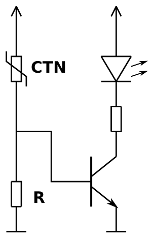

Il utilise une thermistance. Ce composant a une résistance variable en fonction de la température. Un transistor est utilisé pour amplifier le signal de la thermistance. Il est utilisé en “tout ou rien” : tant que la résistance est trop élevée pour que le transitor conduise, la LED est éteinte. Mais dès que la thermistance atteint une résistance suffisamment faible pour que la tension de seuil du transistor soit atteinte, le transistor va conduire et la LED s’allumer.

On considère que le transistor a un gain important et qu’on peut donc négliger le courant de base dans les calculs. Le composant noté *CTN* est une thermistance dont le coefficient de température est négatif. Sa résistance (donnée en kΩ) varie avec la température selon la courbe suivante :

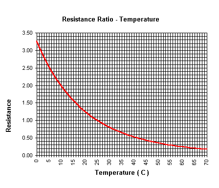

**Question :** Quel valeur doit-on donner à la résistance R pour que le détecteur avertisse du risque de gel vers 1°C ?

Cherchez par vous-même la réponse. Ensuite, vous pourrez voir le [Corrigé](https://class.coursera.org/microcontroleurs-004/wiki/view?page=corr-ex1-2-1) !

## *Ex 1.3-1* Logique à transistors

**Question :** Quelle est la fonction logique réalisée par ce montage ?

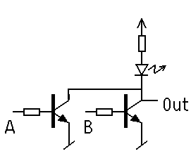

Cherchez par vous-même la réponse. Ensuite, vous pourrez voir le [Corrigé](https://class.coursera.org/microcontroleurs-004/wiki/view?page=corr-ex1-3-1) !

## *Ex 1.4-1* Schéma du OU-exclusif

Voici la table de vérité de la fonction OU-exclusif :

| A | B | S |
| - | - | - |
| 0 | 0 | 0 |
| 0 | 1 | 1 |
| 1 | 0 | 1 |
| 1 | 1 | 0 |

**Question :** Dessinez le schéma logique correspondant.

Cherchez par vous-même la réponse. Ensuite, vous pourrez voir le [Corrigé](https://class.coursera.org/microcontroleurs-004/wiki/view?page=corr-ex1-4-1) !

## *Ex 1.4-2* Diagramme temporel

**Question :** Donnez la table de vérité du système combinatoire décrit par ce diagramme temporel.

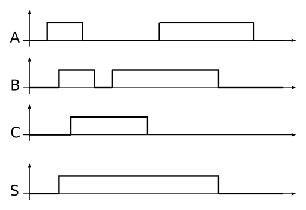

Cherchez par vous-même la réponse. Ensuite, vous pourrez voir le [Corrigé](https://class.coursera.org/microcontroleurs-004/wiki/view?page=corr-ex1-4-2) !

## *Ex 1.5-1* Machine d’état

**Question :** Étudiez la réalisation d’un compteur-décompteur par 5. Vous pouvez successivement :

- dessiner le schéma-bloc du système, avec ses entrées et ses sorties
- dessiner le graphe d’état
- réfléchir au nombre de bascules nécessaires
- dessiner et remplir la table de vérité du système combinatoire
- écrire les équation du système combinatoire.

Cherchez par vous-même la réponse. Ensuite, vous pourrez voir le [Corrigé](https://class.coursera.org/microcontroleurs-004/wiki/view?page=corr-ex1-5-1) !

## *Ex 1.6-1* Conversion décimal-binaire

**Question :** Convertissez en binaire les nombres décimaux suivant : `5`, `12`, `63`, `257`, `1280`

Cherchez par vous-même la réponse. Ensuite, vous pourrez voir le [Corrigé](https://class.coursera.org/microcontroleurs-004/wiki/view?page=corr-ex1-6-1) !

## *Ex 1.6-2* Conversion binaire-Hexadécimal

**Question :** Convertissez en hexadécimal les nombres binaires suivant : `0b00110111`, `0b01011111`, `0b1110010011011001`, `0b101111001`

Cherchez par vous-même la réponse. Ensuite, vous pourrez voir le [Corrigé](https://class.coursera.org/microcontroleurs-004/wiki/view?page=corr-ex1-6-2) !

## *Ex 1.6-3* Conversion BCD-décimal

**Question :** Convertissez en décimal les nombres BCD suivant : `0010001101011001` et `1110010011011001`

Cherchez par vous-même la réponse. Ensuite, vous pourrez voir le [Corrigé](https://class.coursera.org/microcontroleurs-004/wiki/view?page=corr-ex1-6-3) !

# Semaine 2

Vous trouvez ci-dessous des exercices libres. Comme le passage des vidéos à ces exercices a été jugé trop brutal, décourageant plusieurs étudiants, nous avons été amenés à écrire une série de documents détaillant les notions essentielles et s’appuyant sur des exemples progressifs à vérifier avec du matériel, le LearnCbot (ou un câblage équivalent sur Breadboard, décrit dans la dernière vidéo). La semaine dernière, nous vous avions déjà proposé :

- pour *Arduino/Diduino* : [LC1.pdf](http://didel.com/coursera/LC1.pdf)
- pour *Energia/MSP430* : [LC1-msp.pdf](http://pyr.ch/coursera/LC1-msp.pdf)

Assurez-vous d’avoir compris le premier document ! Vous êtes encouragés cette semaine à travailler avec le second document :

- pour *Arduino/Diduino* : [LC2.pdf](http://didel.com/coursera/LC2.pdf)
- pour *Energia/MSP430* : [LC2-msp.pdf](http://pyr.ch/coursera/LC2-msp.pdf)

## *Ex 2.2-1* Microprocesseur et microcontrôleur

**Question :** Quelle est la différence entre un microcontrôleur et un microprocesseur ?

Cherchez par vous-même la réponse. Ensuite, vous pourrez voir le [Corrigé](https://class.coursera.org/microcontroleurs-004/wiki/view?page=corr-ex2-2-1) !

## *Ex 2.3-1* Microcontrôleurs 8-16-32 bits

Dans une application qui nécessite une bonne précision de calcul, on doit effectuer plusieurs fois par seconde quelques calculs arithmétiques avec des nombres de 32 bits.

**Question :** Est-ce qu’on est obligé alors de choisir un microcontrôleur 32 bits ?

Cherchez par vous-même la réponse. Ensuite, vous pourrez voir le [Corrigé](https://class.coursera.org/microcontroleurs-004/wiki/view?page=corr-ex2-3-1) !

## *Ex 2.3-2* Fréquence et puissance de calcul

**Question :** Si la fréquence d’un microcontrôleur est supérieure à celle d’un autre microcontrôleur, peut-on dire alors que sa puissance de calcul est supérieure ?

Cherchez par vous-même la réponse. Ensuite, vous pourrez voir le [Corrigé](https://class.coursera.org/microcontroleurs-004/wiki/view?page=corr-ex2-3-2) !

## *Ex 2.4-1* Programmation en *C/Arduino* : clignoter pendant que l’on presse

Un poussoir actif a zéro est câblé sur la pin 4. Une LED sur la pin 5. Si on presse (statique), la LED doit clignoter à 2 Hz (période 500 ms).

Cherchez par vous-même à écrire le programme. Ensuite, vous pourrez voir le [Corrigé](https://class.coursera.org/microcontroleurs-004/wiki/view?page=corr-ex2-4-1) !

## *Ex 2.4-2* Programmation en *C/Arduino* : allumer 2 s quand on presse

Si on presse (dynamique), le programme doit allumer la LED pendant 2 s. Tester en pressant plus ou moins vite.

Cherchez par vous-même à écrire le programme. Ensuite, vous pourrez voir le [Corrigé](https://class.coursera.org/microcontroleurs-004/wiki/view?page=corr-ex2-4-2) !

## *Ex 2.4-3* Programmation en *C/Arduino* : Un poussoir pour 2 LEDs

On a un poussoir et deux LEDs. Le poussoir a une action quand on presse. Si on presse, la LED 1 change d’état. Si on presse et seulement si la LED 1 est allumée, la LED 2 change d’état.

Écrire le programme et dire ce que l’on a programmé.

Cherchez par vous-même à écrire le programme. Ensuite, vous pourrez voir le [Corrigé](https://class.coursera.org/microcontroleurs-004/wiki/view?page=corr-ex2-4-3) !

## *Ex 2.4-4* Programmation en *C/Arduino* : Deux poussoir pour une LEDs

Le poussoir Pous1 doit allumer la LED. Le poussoir Pous2 doit l’éteindre. On va reconnaître la bascule RS.

Cherchez par vous-même à écrire le programme. Ensuite, vous pourrez voir le [Corrigé](https://class.coursera.org/microcontroleurs-004/wiki/view?page=corr-ex2-4-4) !

## *Ex 2.5-1* Programmation d’un compteur up/down

On a une variable `byte compteur;` dont on va modifier la valeur avec deux poussoirs qui agissent statiquement. On ne sait pas encore comment afficher cette valeur, mais pour avoir une idée, on allume la LED pour les
    valeurs impaires. Un clignotement de la LED indique que le compteur augmente ou diminue (rajouter des LEDs si vous voulez).

Quand on pèse sur Pous1 et on maintien pressé (action statique), le compteur augmente chaque 0.2 s, mais se bloque à 7, LED allumée puisque c’est impair.

Quand on pèse sur Pous1 et maintien pressé, le compteur décompte et se bloque à zéro, LED éteinte.

Cherchez par vous-même à écrire le programme. Ensuite, vous pourrez voir le [Corrigé](https://class.coursera.org/microcontroleurs-004/wiki/view?page=corr-ex2-5-1) !

## *Ex 2.5-2* Estimation de la durée de la fonction *Arduino* `Map ()`

La fonction *Arduino* `map()` doit faire des multiplications et division. Quel est son temps de calcul ?

On met cette fonction dans une boucle exécutée 10’000 fois (max 30000 en 16 bits signés). On mesure la période entre deux basculements de la LED. Si la fonction dure 100 µs, la période est de 1 s. Écrire le programme et dire quelle
    est la durée de la fonction map().

Cherchez par vous-même à écrire le programme. Ensuite, vous pourrez voir le [Corrigé](https://class.coursera.org/microcontroleurs-004/wiki/view?page=corr-ex2-5-2) !

# Semaine 3

Vous trouvez ci-dessous des exercices libres qui ont été proposés pour notre premier MOOC en octobre 2013. Ils complètent notre suite d’exemples et exercices à tester avec le LearnCbot ou un câblage équivalent. Voici les fichiers de la semaine :

- pour *Arduino* :  [LC3.pdf](http://www.didel.com/coursera/LC3.pdf)
- pour *Energia/MSP430* : [LC3-msp.pdf](http://pyr.ch/coursera/LC3-msp.pdf)

Ces documents doivent être lus attentivement pour se familiariser avec la richesse du *C*.

Les programmes sont disponibles sous forme de fichier zip :

- pour *Arduino* :  [LC3ino.zip](http://www.didel.com/coursera/LC3ino.zip)
- pour *Energia/MSP430* : [LC3msp.zip](http://pyr.ch/coursera/LC3msp.zip)

Ils vous permettent de passer plus de temps sur leur lecture et vos essais de modification. Prenez plaisir à vos progrès !

## *Ex 3.1-1* Variables et arithmétiques

Nous avons les variables suivantes :

	byte x=8; byte y=3; byte z=250;

Rappels:

- le type `byte` (ou `unsigned char`) est un nombre entier de 8 bits, capable de prendre des valeurs de 0 à 255.
- l’opération `/` est la division entière
- l’opération % est le reste de la division entière

**Question :** Calculez :

1. `x + y`
2. `y + z`
3. `x + z`
4. `y - x`
5. `x / y`
6. `y / x`
7. `z / y`
8. `z % y`

Cherchez par vous-même la réponse. Ensuite, vous pourrez voir le [Corrigé](https://class.coursera.org/microcontroleurs-004/wiki/view?page=corr-ex3-1-1) !

## *Ex 3.1-2* Autre manière d’écrire la boucle `for`

Quand on écrit une boucle : `for (i=0; i<10; i++) {instructions}` on passe trois paramètres au compilateur :

1. l’instruction d’initialisation (ici `i=0;`) : cette instruction qui va s’exécuter une et une seule fois au début
2. la condition d’exécution de la boucle (ici `i<10;`) : un test, répété à chaque début de boucle, qui permet de savoir si elle doit s’exécuter (ou s’arrêter)
3. l’instruction “d’incrémentation” (ici `i++`) : ce terme est inexact. Il s’agit souvent d’une incrémentation, mais c’est simplement une instruction qui s’exécute à la fin de chaque itération de la boucle.

Écrivez cette même action sans le mot `for` !

Cherchez par vous-même la réponse. Ensuite, vous pourrez voir le [Corrigé](https://class.coursera.org/microcontroleurs-004/wiki/view?page=corr-ex3-1-2) !

## *Ex 3.1-3* Utilisation de l’instruction `break`

L’instruction `break;` permet de sortir d’un `{ bloc d’instructions }` avant sa fin. Il est souvent utilisé comme une sortie “en catastrophe”. Par exemple, on peut lancer un clignotement dans une boucle `while ()` et en sortir avec un break; après le 3e clignotement :

	// extrait du programme Solution310.ino
	byte i=0;
	while (1)
	  Led1On; delay (500);
	  Led1Off; delay (500);
	  if (i >= 3) { break; }
	  i++;
	}
	delay (1000); // on continue avec d’autres
	              // instructions ou on
	              // recommence dans
	              // la boucle principale.

**Question :** Écrire un programme qui attend une pression sur Pous1 et sort de l’attente en clignotant si on ne presse pas dans les 5 s. On doit donc presser régulièrement pour réinitialiser un compteur qui augmente avec une période de
    50 ms.

Cherchez par vous-même la réponse. Ensuite, vous pourrez voir le [Corrigé](https://class.coursera.org/microcontroleurs-004/wiki/view?page=corr-ex3-1-3) !

## *Ex 3.2-1* Test de tous les ports d’un microcontrôleur

Écrivez un programme qui teste toutes les sorties d’un microcontrôleur en les faisant clignoter : tous les bits pairs allumés, puis tous les bits impairs.

Écrivez-le pour un *AVR* ou un *MSP430G*.

Rappels :

- Le microcontrôleur *ATmega328* de l’*Arduino* dispose des port `B`, `C` et `D`. Les bits pairs sont `PB0`, `PB2`, `PB4`, ..., `PC0`, `PC2`,... et les bits impairs `PB1`, `PB3`,..., `PC1`, `PC3`... Les registres de direction s’appellent `DDR` (`DDRB`, `DDRC`, etc.) et les registres de sortie s’appellent `PORT` (`PORTB`, `PORTC`, etc.)
- Le microcontrôleur *MSP430G2553* du *LaunchPad* dispose des ports `P1` et `P2`. Les registres de direction s’appellent `P1DIR` (et `P2DIR`) et les registres de sortie s’appellent `P1OUT` (et `P2OUT`).

Cherchez par vous-même la réponse. Ensuite, vous pourrez voir le [Corrigé](https://class.coursera.org/microcontroleurs-004/wiki/view?page=corr-ex3-2-1) !

## *Ex 3.2-2* _Charlieplexing_

Comment faire lorsqu’on a 6 LED, qu’on doit pouvoir en allumer une parmi les 6 et qu’on ne dispose que de 3 pattes sur un microcontrôleur ?

Il existe une solution astucieuse, connue sous le nom de _Charlieplexing_ !

Voici le schéma :

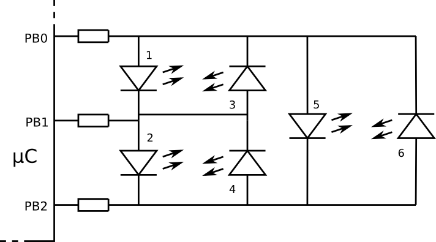

Écrivez les deux instructions qui allument la LED 5 sans en allumer d’autres.

Cherchez par vous-même la réponse. Ensuite, vous pourrez voir le [Corrigé](https://class.coursera.org/microcontroleurs-004/wiki/view?page=corr-ex3-2-2) !

## *Ex 3.3-1* Champs de bits

Écrivez d’une manière plus lisible l’instruction suivante : `DDRC = 0b01000001;`

Cherchez par vous-même la réponse. Ensuite, vous pourrez voir le [Corrigé](https://class.coursera.org/microcontroleurs-004/wiki/view?page=corr-ex3-3-1) !

## *Ex 3.4-1* Combien de 1 ?

On doit compter le nombre de _1_ dans un mot de 16 bits. L’algorithme consiste à tester si le bit en extrémité vaut _1_ ou _0_, puis à décaler.

Indiquez le résultat par des clignotements. Tester des données en :

- binaire : `mot= 0b0000 1000 0100 1100;` résultat `4`
- hexadécimal : `mot = 0x 3C41;` résultat `6`
- décimal : `mot = 1025;` résultat `2 // le compilateur converti en binaire, pas en BCD.`

Cherchez par vous-même la réponse. Ensuite, vous pourrez voir le [Corrigé](https://class.coursera.org/microcontroleurs-004/wiki/view?page=corr-ex3-4-1) !

## *Ex 3.5-1* Clignoter toujours plus

On vient de voir une boucle `for` pour clignoter un certain nombre de fois. Écrivez une fonction qui permettra d’écrire dans le programme :

	ClignoterNfois (nombre de fois);

Utiliser cette fonction dans un programme qui clignote une fois, deux fois, etc .et s’arrête à _5_ fois.

Cherchez par vous-même la réponse. Ensuite, vous pourrez voir le [Corrigé](https://class.coursera.org/microcontroleurs-004/wiki/view?page=corr-ex3-5-1) !

## *Ex 3.5-2* Clignoter davantage en accélérant

Cette fonction a un 2e paramètre qui est la vitesse. Testez avec un programme qui à la fois augmente le nombre de clignotements et la fréquence, avec une durée de salve constante. On voit donc le produit de la période par le nombre d’impulsions est constant.

Cherchez par vous-même la réponse. Ensuite, vous pourrez voir le [Corrigé](https://class.coursera.org/microcontroleurs-004/wiki/view?page=corr-ex3-5-2) !

## *Ex 3.5-3* Mesurer une durée

On veut une fonction qui mesure la durée pendant laquelle on presse sur un poussoir. La durée sera en unités de 50 ms, mais on essayera des valeurs plus faibles jusqu’à être perturbé par les rebonds de contact. Pour tester, écrire le programme qui allume la LED 1 si on est très rapide, et la LED 2 si on est lent.

Cherchez par vous-même la réponse. Ensuite, vous pourrez voir le [Corrigé](https://class.coursera.org/microcontroleurs-004/wiki/view?page=corr-ex3-5-3) !

# Semaine 4

Voici les fichiers **LearnCbot** de la semaine :

- pour *Arduino* :  [LC4.pdf](http://www.didel.com/coursera/LC4.pdf)
- pour *Energia/MSP430* : [LC4-msp.pdf](http://pyr.ch/coursera/LC4-msp.pdf)

Les programmes correspondants sont disponibles sous forme de fichier zip :

- pour *Arduino* :  [LC4ino.zip](http://www.didel.com/coursera/LC4ino.zip)
- pour *Energia/MSP430* : [LC4msp.zip](http://pyr.ch/coursera/LC4msp.zip)

Voici également des exercices de la session 2013, qui pourront aussi vous aider à préparer les devoirs et l’évaluation :

## *Ex 4.1-1* Cadre lumineux d’une enseigne

Une enseigne publicitaire est entourée d’un cadre réalisé avec des segments lumineux, selon le croquis suivant :

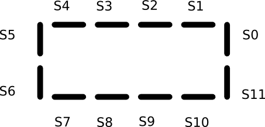

On cherche à donner une impression de rotation, en allumant successivement les groupes de segments suivants :

	- S0, S1, S3, S4, S6, S7, etc. (011011011011)
	- S1, S2, S4, S5, S7, S8, etc. (110110110110)
	- S0, S2, S3, S5, S6, S8, etc. (101101101101)

On dispose d’une procédure `AfficheCadre (unsigned int segments)` qui affiche les segments _S0_ à _S11_ selon les bits _0_ à _11_ du paramètre “segments” et d’une procédure `AttenteMs (int ms)`.

Écrivez la boucle principale du programme qui fait “tourner” le cadre dix fois dans un sens, puis dix fois dans l’autre sens.

Cherchez par vous-même la réponse. Ensuite, vous pourrez voir le [Corrigé](https://class.coursera.org/microcontroleurs-004/wiki/view?page=corr-ex4-1-1) !

## *Ex 4.2-2* Détection de sortie par l’entrée d’un supermarché

Afin de lutter contre le vol à l’étalage, la direction d’un supermarché souhaite contrôler que les clients n’utilisent pas l’entrée pour sortir du magasin.

Deux barrières lumineuses vont être installées au niveau de l’entrée, à la même hauteur, distantes l’une de l’autre de 5 cm. Lorsqu’un client entre, la première barrière est coupée, puis la seconde. Si un client passe dans l’autre sens, ce sera le contraire. Un microcontrôleur reçoit les signaux de ces deux capteurs.

Écrivez le programme pour commander le contact d’un avertisseur sonore durant 5 s lorsqu’un client sort du magasin par l’entrée.

Cherchez par vous-même la réponse. Ensuite, vous pourrez voir le [Corrigé](https://class.coursera.org/microcontroleurs-004/wiki/view?page=corr-ex4-2-2) !

## *Ex 4.3-1* Automate simple

On a construit une machine avec un moteur et un contact qui se ferme à chaque tour. En pressant sur un bouton on veut que la machine fasse un tour et s’arrête. Vous voulez voir une jolie application ? <http://www.bricobot.ch/kits/Miaou.pdf>

Pour tester le programme, on utilise Pous1 pour démarrer, LED 1 pour dire que le moteur tourne et Pous2 comme fin de course.

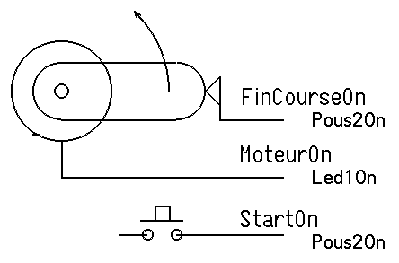

Le diagramme des temps montre les états possibles. Il faut tenir compte du fait que le signal Start peut durer plus longtemps que l’action, et le fin de course peut encore être activé après l’arrêt du moteur. Le programme est plus simple si on enlève ces conditions, mais ce n’est que de 2 instructions!

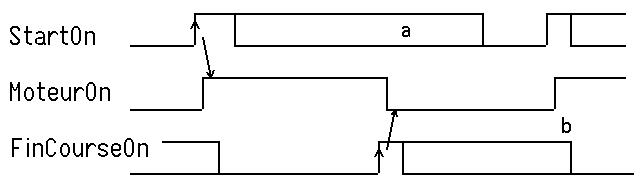

Cherchez par vous-même la réponse. Ensuite, vous pourrez voir le [Corrigé](https://class.coursera.org/microcontroleurs-004/wiki/view?page=corr-ex4-3-1) !

## *Ex 4.3-2* Commande d’un monte-charge

La cabine d’un monte-charge entre deux étages est actionnée par un moteur, dont la commande dispose des entrées `Monte` et `Descend`.

Deux interrupteurs de fin de course `FinHaut` et `FinBas` détectent les positions des étages.

Deux poussoirs `AppelHaut` et `AppelBas` permettent de faire monter et descendre la cabine.

Le programme qui commande le monte-charge est une machine d’état.

Voici une proposition de marche à suivre pour faciliter le dessin du graphe d’état :

- établissez la liste des entrées et des sorties
- définissez des états pour le système
- notez les valeurs de sortie pour chaque état
- repérez les transitions entre les états
- notez les conditions associées à ces transitions.

Une fois le graphe d’état établi, écrivez le programme par étapes successives, en suivant les informations du graphe d’état :

- définissez les états (par un `enum`)
- associez les valeurs des sorties
- écrivez les transitions

Il reste à s’occuper de l’implémentation matérielle des entrées et des sorties.

Cherchez par vous-même la réponse. Ensuite, vous pourrez voir le [Corrigé](https://class.coursera.org/microcontroleurs-004/wiki/view?page=corr-ex4-3-2) !

## *Ex 4.4-1* Dé électronique

Les 7 LEDs d’un dé sont câblées comme ci-contre pour utiliser un nombre minimum de sorties du microcontrôleur. Ces sorties sont les pins _0_ à _4_ du `PORTC` *Arduino* _(pins 14,15,16,17,18)_ ou pour *MSP* les pins _0_ à _4_ de `P2`. Créer la table correspondant aux 6 états du dé et écrire le programme qui “lance le dé” toutes les secondes. Évidemment, on ne va pas définir les pins indépendamment. Dans le `setup` on dit que les bits _0_ à _3_ sont en sorties, et on copie les configurations de bits correspondant aux faces du dé directement sur le _port C_.

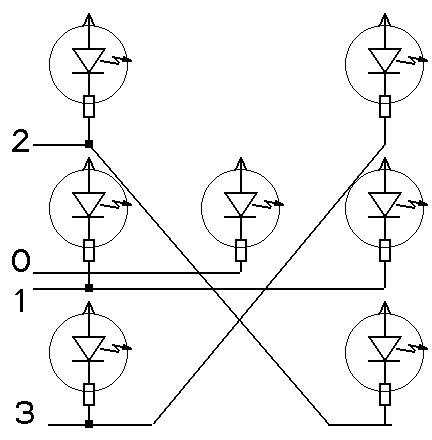

Cherchez par vous-même la réponse. Ensuite, vous pourrez voir le [Corrigé](https://class.coursera.org/microcontroleurs-004/wiki/view?page=corr-ex4-4-1) !

# Semaine 5

Voici les fichiers **LearnCbot** de la semaine :

- pour *Arduino* :  [LC5.pdf](http://www.didel.com/coursera/LC5.pdf)
- pour *Energia/MSP430* : [LC5-msp.pdf](http://pyr.ch/coursera/LC5-msp.pdf)

Les programmes correspondants sont disponibles sous forme de fichier zip :

- pour *Arduino* :  [LC5ino.zip](http://www.didel.com/coursera/LC5ino.zip)
- pour *Energia/MSP430* : [LC5msp.zip](http://pyr.ch/coursera/LC5msp.zip)

Voici également quelques exercices de la session 2013, qui pourront aussi vous aider :

## *Ex 5.1-1* Message Morse

Vous connaissez déjà le sujet, à cause du devoir de la semaine 3 ! Allons un peu plus dans le détail.

L’exercice est de lire avec le terminal un caractère et de clignoter son code en Morse.

Chaque lettre est codée dans 8 bits, 3 bits pour le nombre de _ti-ta_, 5 bits pour le code, _0_ pour _ti_, _1_ pour _ta_. La figure montre quelques exemples de ce codage.

Voici un extrait tiré de [Wikipedia](http://en.wikipedia.org/wiki/Morse_code)

> International Morse code is composed of five elements:
>
> 1. short mark, dot or “dit” (·) — “dot duration” is one time unit long
> 2. longer mark, dash or “dah” (–) — three time units long
> 3. inter-element gap between the dots and dashes within a character — one dot duration or one unit long
> 4. short gap (between letters) — three time units long
> 5. medium gap (between words) — seven time units long[1]
>     If W is the word/min (10-20), dot period T is 1200 / W

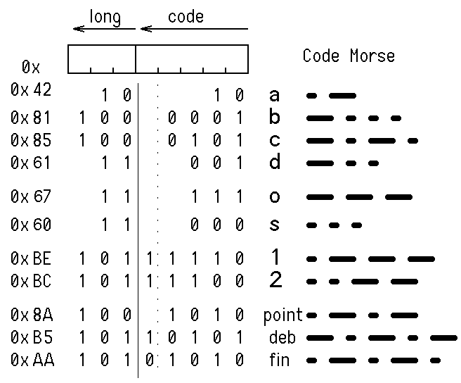

La période _T_, durée d’un _dot_, sert à définir les autres durées. Pour le test, limitons-nous au début du code ASCII. En morse, la lettre _A_ sera naturellement en _0_ dans la table. En ASCII, si on tape _ABC_ avec le programme terminal, on obtient les codes _0x41 42 43_ qu’il faut faire correspondre aux entrées _0 1 2_ de la table :

	//              A    B    C    D    E    F    G    H
	TaMorse [] = {0x42,0x81,0x85,0x61,0x20,0x84,0x63,0x80};

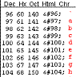

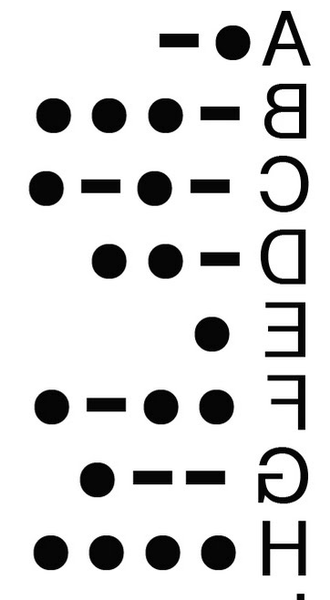

Le programme attend une lettre du terminal (lettre-CR, voir doc) et joue les flashs ou sons. Les espaces entre lettres et mots peuvent être ignorés.

Cherchez par vous-même la réponse. Ensuite, vous pourrez voir le [Corrigé](https://class.coursera.org/microcontroleurs-004/wiki/view?page=corr-ex5-1-1) !

## *Ex 5.4-1* Lire 4 poussoirs sur une entrée analogique

On peut lire plusieurs poussoirs en n’utilisant qu’une entrée analogique. Plusieurs câblages sont possibles. La solution proposée pour 4 poussoirs est spécialement simple à comprendre, son inconvénient éventuel est de consommer 1 mA en permanence ( la pull-down ne consomme rien).

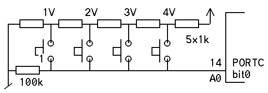

Évidemment, pour lire les poussoirs, faut tester les tensions...

Cherchez par vous-même la réponse. Ensuite, vous pourrez voir le [Corrigé](https://class.coursera.org/microcontroleurs-004/wiki/view?page=corr-ex5-4-1) !

## *Ex 5.5-1* Affichage de nombres

Si on exécute `Serial.print (3,BIN)` : le résultat est `11`. On aimerait bien voir `00000011`. C’est logique de supprimer les _0_ non significatifs dans les nombres décimaux, mais pas pour le binaire et l’hexa.

Écrire la fonction `PrintBin ()` qui affiche le nombre binaire complet. Elle est facile à programmer: on regarde un bit après l’autre en décalant à gauche et on affiche en ASCII _0_ ou _1_. Le code de _0_ est _'0'_, mais le terminal travaille avec des chaînes de caractères ASCII: il faut écrire `Serial.print ("0")`.

Programmez et testez aussi la fonction `PrintHex ()`, qui vous fera réfléchir comment convertir les chiffres 4 bits: `0000 ⇒ '0' 1010 ⇒ 'A'`

Cherchez par vous-même la réponse. Ensuite, vous pourrez voir le [Corrigé](https://class.coursera.org/microcontroleurs-004/wiki/view?page=corr-ex5-5-1) !

Les corrigés compatibles *Arduino* se trouvent dans [Sem5SolutionsArduino.zip](http://www.didel.com/coursera/Sem5SolutionsArduino.zip)

# Semaine 6

Voici les fichiers **LearnCbot** de la semaine :

- pour *Arduino* :  [LC6.pdf](http://www.didel.com/coursera/LC6.pdf)
- pour *Energia/MSP430* : [LC6-msp.pdf](http://pyr.ch/coursera/LC6-msp.pdf)

Les programmes correspondants sont disponibles sous forme de fichier zip :

- pour *Arduino* :  [LC6ino.zip](http://www.didel.com/coursera/LC6ino.zip)
- pour *Energia/MSP430* : [LC6msp.zip](http://pyr.ch/coursera/LC6msp.zip)

## *Ex 6.2-1* Dessin sur un afficheur matriciel

Un afficheur matriciel de 16×16 LEDs est commandé par un microcontrôleur. Des procédures d’écriture de points ont été écrites :

	void SetPoint (int x; int y)
	void ClearPoint (int x; int y)

Les coordonnées _x_ et _y_ varient de _0_ à _15_. Le point _(0, 0)_ est en haut à gauche de l’afficheur.

On dispose aussi d’une procédure `void Affiche (int duree)` qui rafraîchit l’affichage, dont la durée est multiple de 10 ms.

Écrivez un programme qui affiche de manière “dynamique” la lettre Z, un peu comme Zorro le fait avec son épée !

Une vidéo montre l’effet désiré : [exemple-aff.mp4](http://pyr.ch/coursera/exemple-aff.mp4)

Cherchez par vous-même la réponse. Ensuite, vous pourrez voir le [Corrigé](https://class.coursera.org/microcontroleurs-004/wiki/view?page=corr-ex6-2-1) !

**Vous pouvez même tester votre programme :** Un afficheur programmable à distance vous est proposé dans la page des devoirs de programmation.

## *Ex 6.2-2* Affichage des changements de joueur

Pour le championnat interuniversitaire de football, les étudiants d’une école d’ingénieurs décident de fabriquer un panneau pour indiquer les changements de joueurs. Les étudiants en génie mécanique ont réalisé une maquette qui se présente de la manière suivante :

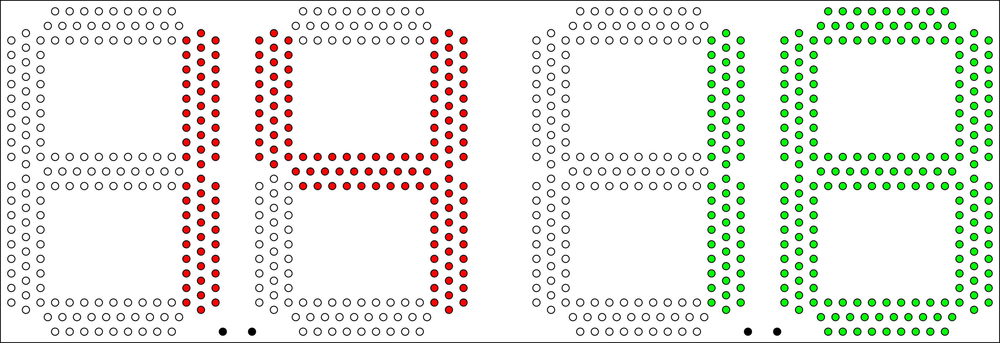

Des LEDs rouges et vertes de 5 mm de diamètre sont utilisées. Deux paires de boutons-poussoirs permettent de choisir les numéros des joueurs qui entrent et qui sortent.

Les étudiants en génie électrique sont chargés de réaliser la commande électronique. Les LEDs Rouges choisies ont une tension de _2 V_, les vertes _3 V_. Les deux modèles ont un courant nominal de _10 mA_.

Proposez un schéma pour réaliser la commande de ce panneau.

Choisissez un microcontrôleur et l’électronique nécessaire pour commander les 4 fois 7 segments de 28 LEDs chacun.

Cherchez par vous-même la réponse. Ensuite, vous pourrez voir le [Corrigé](https://class.coursera.org/microcontroleurs-004/wiki/view?page=corr-ex6-2-2) !

## *Ex 6.3-1* Routines SPI

Le but ce cet exercice est de comparer trois approches pour transférer 16 bits dans un registre à décalage commandant 16 LEDs.

Pour la première solution, utilisez la primitive `shiftOut` d’*Arduino*, abondamment documentée sur internet. Il faudra appeler 2 fois `shiftOut` pour un transfert 16 bits.

Exécutez le transfert 1000 fois et changez l’état de la LED 1 pour évaluer le temps d’exécution. Notez la taille du code généré.

Pour la 2e solution, utilisez la librairie SPI qui passe par le registre SPI interne du microcontrôleur. Il faut utiliser les pins SPI.
[ReferenceSPI](http://arduino.cc/en/Reference/SPI)

Pour la 3e solution, utilisez les instructions *C* `(bitSet, bit Clear);` le choix de pins n’a pas d’importance, vous pouvez utiliser les mêmes que dans l’exemple *Arduino*. Notez aussi la taille mémoire et le temps d’exécution.

Cherchez par vous-même la réponse. Ensuite, vous pourrez voir le [Corrigé](https://class.coursera.org/microcontroleurs-004/wiki/view?page=corr-ex6-3-1) !

## *Ex 6.5-1* Système sur batteries

Pour essayer d’effrayer les taupes qui faisaient des ravages dans son jardin potager, un jardinier a installé un dispositif qui émet des bruits de manière pseudo-aléatoire, par courtes séquences. En moyenne, le dispositif est actif au total 90 s chaque heure. La consommation en mode actif est de 40 mA. Le microcontrôleur consomme lui-même 1 mA en permanence, en fonctionnant à 1 MHz. Les deux piles 1.5 V AA utilisées ont une capacité de 1300 mAh.

Calculez la durée de vie d’un jeu de piles. Proposez des solutions pour que le système consomme globalement moins de courant, en vue de lui donner une meilleure autonomie.

Cherchez par vous-même la réponse. Ensuite, vous pourrez voir le [Corrigé](https://class.coursera.org/microcontroleurs-004/wiki/view?page=corr-ex6-5-1) !

# Semaine 1

## *Corr 1.2-1* Détecteur de gel

La thermistance prend une valeur de 3.1 kΩ à 1°C. Pour que la tension de base soit égale à 0.7 V, la tension au borne de la thermistance est de 5 V - 0.7 V = 4.3 V. Le courant dans la thermistance est donc de I = U / R = 4.3 V / 3.1 kΩ = 1.39 mA.

Le courant dans la thermistance est le même que dans le résistance R (si le courant de base est négligeable).

Aux bornes de la résistance R, on a une tension de 0.7 V (c’est la tension de base). Pour que le courant soit de 1.39 mA, elle doit être de R = U / I = 0.7 V / 1.39 mA = 503 Ω, donc environ 500 Ω. Il faudra ajuster cette valeur pour avoir une détection précise : on utilisera une résistance variable (par exemple de 100 Ω) en série avec une résistance fixe (par exemple de 470 Ω).

## *Corr 1.3-1* Logique à transistors

Chaque transistor va conduire quand l’entrée correspondante est à _1_. Tant qu’aucun des transistors ne conduit, aucun courant ne peut circuler. La sortie est alors à _1_, à cause de la résistance et de la LED sur les collecteurs, reliés au plus.

Quand un des deux transistors conduit (ou les deux), la sortie passe à _0_. On a donc une porte NOR.

Équation logique : A + B

Mais attention : la LED s’allume quand la sortie est à _0_. Elle montre donc l’inverse de la sortie (fonction OU).

## *Corr 1.4-1* Schéma du OU-exclusif

Il est pratique de commencer par écrire l’équation logique à partir de la table de vérité :

S = A ⋅ B + A ⋅ B

Voici le schéma correspondant :

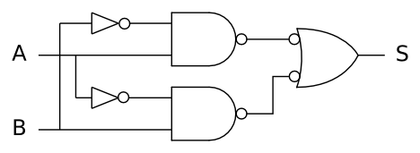

La porte de droite est bien une porte NAND (par le théorème de De Morgan)

A ⋅ B = A + B

## *Corr 1.4-2* Diagramme temporel

Il est facile de remplir les cases de la table de vérité en suivant le diagramme temporel

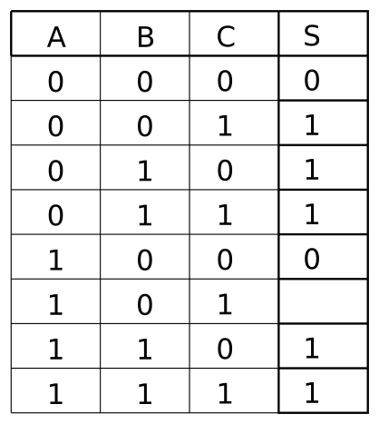

Mais on finit par voir qu’il manque un cas !

Le diagramme des temps n’est généralement pas un bon moyen de représenter un système combinatoire. Mais il est très utile pour étudier les systèmes séquentiels.

## *Corr 1.5-1* Machine d’état

Il faut commencer par déterminer les entrées et les sorties du système, puis dessiner un graphe d’état :

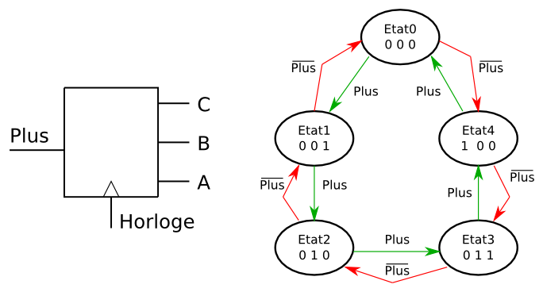

Le système va changer d’état à chaque coup d’horloge. L’état suivant dépend de l’entrée de comptage-décomptage, qu’on a appelée _Plus_. Il a 5 états. Il faut donc au moins 3 bascules pour mémoriser les états. Le système combinatoire qui va donner les nouvelles valeur aux entrées des bascules aura donc 4 entrées : l’entrée _Plus_ et les 3 sorties des bascules, qui représentent l’état courant.

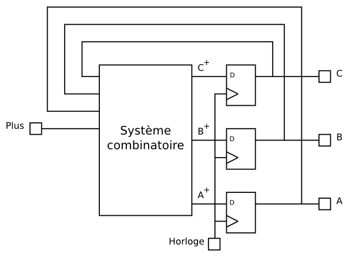

Remplissons la table de vérité, en donnant pour chaque ligne l’état futur (valeur de comptage) en fonction de la valeur courante et du mode de comptage. Écrivons ensuite les équations.

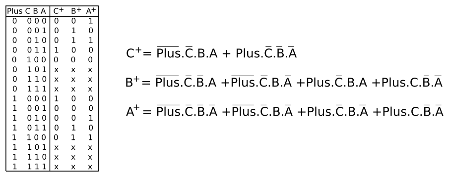

C’est bien compliqué ! Il faudrait encore simplifier, en appliquant les propriétés de l’algèbre de Boole aux équations ou en utilisant les tables de Karnaugh.

Ce sera peut-être plus simple de programmer un microcontrôleur...

## *Corr 1.6-1* Conversion décimal-binaire

On se souvient des puissance de _2 : 1 2 4 8 16 32 64 128 256 512 1024 2048 4096..._

On peut par exemple soustraire successivement les puissances de _2_ qu’il est possible de soustraire au nombre.

_5 = 4*1 + 2*0 + 1*1 = 4 + 1 = 0b101_

_12 = 8 + 4 = 0b1100_

_63 = 32 + 16 + 8 + 4 + 2 + 1 => 0b111111_

Autre moyen de calculer :

_63 = 64 - 1 = 0b1000000 - 1 = 0b111111_

_257 = 256 + 1 = 0b100000001_

_1280 = 1024 + 256 = 0b10100000000_

## *Corr 1.6-2* Conversion binaire-Hexadécimal

Il faut commencer par couper le nombre binaire en tranches de 4 bits, depuis la droite, puis utiliser la table de conversion :

_0000 = 0, 0001 = 1, 0010 = 2, 0011 = 3, 0100 = 4, 0101 = 5, 0110 = 6, 0111 = 7_

_1000 = 8, 1001 = 9, 1010 = A, 1011 = B, 1100 = C, 1101 = D, 1110 = E, 1111 = F_

_0b01011111 = 0b0101'1111 = 0x5F_

_0b00110111 = 0b0011'0111 = 0x37_

_0b1110010011011001 = 0b1110'0100'1101'1001 = 0xE4D9_

_0b101111001 = 0b1'0111'1001 = 0x179_

## *Corr 1.6-3* Conversion BCD-décimal

Il faut couper le nombre binaire en tranches de 4 bits, depuis la droite, puis utiliser ta table de conversion :

_0000 = 0, 0001 = 1, 0010 = 2, 0011 = 3, 0100 = 4, 0101 = 5, 0110 = 6, 0111 = 7, 1000 = 8, 1001 = 9_

_0010001101011001 = 0010'0011'0101'1001 = 2359_ (par exemple 23h59 pour réprésenter une heure)

Par contre _1110010011011001_ n’est pas un nombre BCD ! (la valeur _1110_ n’a pas de correspondant dans la table).

# Semaine 2

## *Corr 2.2-1* Microprocesseur et microcontrôleur

Mes étudiants me posent souvent la question...

Un microcontrôleur contient un microprocesseur ! Mais il contient aussi de la mémoire (ROM, RAM) et des circuits d’entrée-sortie, pour être un à lui seul un système informatique autonome.

## *Corr 2.3-1* Microcontrôleurs 8-16-32 bits

Même un processeur 8 bits est capable d’effectuer des calcul sur des nombres de 32 bits. Il faut alors décomposer les opérations en opérations sur des nombres de 8 bits, un peu comme nous avons appris à l’école à effectuer des additions, des soustractions, des multiplications et des divisons ! Mais rassurez-vous : c’est le compilateur qui va faire ce travail, pas vous...

Il faudra peut-être des dizaines ou même des centaines d’opérations élémentaires sur 8 bits pour effectuer un calcul. Mais ce n’est pas grave : rappelez-vous que même le petit processeur contenu dans un microcontrôleur "entrée de gamme" est généralement capable d’exécuter des millions d’instructions par seconde !

## *Corr 2.3-2* Fréquence et puissance de calcul

Il faut être très prudent en comparant des microcontrôleurs (et les processeurs qu’ils contiennent). La fréquence est certainement une indication des performances, mais d’autres facteurs sont aussi très importants :

- la largeur du bus de données (processeur 8 bits-16bits-32bits)
- le nombre de coups d’horloge nécessaire pour l’exécution de chaque instruction
- la richesse du jeux d’instructions
- l’organisation des mécanismes d’interruption
- les performances de l’unité arithmétique
- etc.

## *Corr 2.4-1* Programmation en *C/Arduino* : clignoter pendant que l’on presse

Voici une solution :

	//Solution241.ino
	#define Pous 2 // pin2 Arduino
	#define PousOn digitalRead (Pous) == 0
	#define PousOff digitalRead (Pous) == 1
	#define Led 5
	#define LedOn digitalWrite (Led,LOW) ;
	#define LedOff digitalWrite (Led,HIGH) ;
	void setup () {
	  pinMode (Pous, INPUT) ;
	  pinMode (Led,OUTPUT) ;
	}
	void loop () {
	  if (PousOn) {
	    LedOn ; delay (250);
	    LedOff ; delay (250);
	  }
	}

Variante en ajoutant dans la définition de LedToggle (réagit plus rapidement quand on relâche, pressez rapidement pour voir la différence) :

	void loop () {
	  if (PousOn) {
	    LedToggle ; delay (250);
	  }
	}

## *Corr 2.4-2* Programmation en *C/Arduino* : allumer 2 s quand on presse

Voici une solution :

	//Solution242.ino
	#define Pous 2
	#define PousOn digitalRead (Pous) == 0
	#define PousOff digitalRead (Pous) == 1
	#define Led 5
	#define LedOn digitalWrite (Led,LOW) ;
	#define LedOff digitalWrite (Led,HIGH) ;
	void setup () {
	  pinMode (Pous, INPUT) ;
	  pinMode (Led,OUTPUT) ;
	}
	void loop () {
	  if (PousOn) {
	    LedOn ; delay (2000);
	    LedOff ; // tester un délai
	             // ici delay (1000);
	  }
	  while (PousOn) {}
	}

## *Corr 2.4-3* Programmation en *C/Arduino* : Un poussoir pour 2 LEDs

Voici une solution :

	//Solution243.ino
	#define Led1 5 //Actif à 0 MSP Energia pin xx
	#define Led2 6
	#define Led1Toggle digitalWrite \
	  (Led1, !digitalRead (Led1))
	#define Led2Toggle digitalWrite \
	  (Led2, !digitalRead (Led2))
	#define Pous 2 // actif à 0
	#define PousOn !digitalRead(Pous)
	void setup() {
	  pinMode (Pous,INPUT);
	  pinMode (Led1,OUTPUT);
	  pinMode (Led2,OUTPUT);
	}
	void loop () {
	  while (PousOn) {delay (20);}
	  while (!PousOn){delay (20);}
	  Led1Toggle;
	  if (digitalRead (Led1)) {
	    Led2Toggle;
	  }
	}

On remarque que l’on a programmé un compteur par 4. Les LEDs s’allument dans la séquence `00 01 10 11`

À noter aussi que `if (digitalRead (Led1) == 1)` peut s’écrire `if (digitalRead (Led1))`

## *Corr 2.4-4* Programmation en *C/Arduino* : Deux poussoir pour une LEDs

Voici une solution :

	//Solution244.ino
	#define Pous1 2
	#define Pous2 3
	#define Pous1On !digitalRead (Pous1)
	#define Pous2On !digitalRead (Pous2)
	#define Led 5
	#define LedOn digitalWrite (Led,LOW) ;
	#define LedOff digitalWrite (Led,HIGH) ;
	void setup () {
	  pinMode (Pous1, INPUT) ;
	  pinMode (Pous2, INPUT) ;
	  pinMode (Led,OUTPUT) ;
	}
	void loop () {
	  if (Pous1On) { LedOn ; delay (20); }
	  if (Pous2On) { LedOff ; delay (20); }
	}

Que se passe-t’il si on presse les deux poussoirs ? et quand on relâche ?

## *Corr 2.5-1* Programmation d’un compteur up/down

Voici une solution :

	// UpDown.ino
	#define Led1 5 // actif à 0
	#define Pous1 2 // actif à 0
	#define Pous2 3 // actif à 0
	#define Pous1On !digitalRead (Pous1) // actif
	                                     // à 0
	#define Pous2On !digitalRead (Pous2) // actif
	                                     // à 0
	#define Led1On digitalWrite (Led1, LOW)
	#define Led1Off digitalWrite (Led1, HIGH)
	void setup() {
	  pinMode (Led1, OUTPUT);
	  pinMode (Pous1, INPUT);
	  pinMode (Pous2, INPUT);
	}
	byte compteur = 6;
	void loop() {
	  if (Pous1On) {
	    if (compteur < 7) {
	      compteur ++;
	      if (compteur & 0x01) Led1On ;
	      else Led1Off ;
	      delay (200);
	    }
	  }
	  if (Pous2On) {
	    if (compteur >0) {
	      compteur --;
	      if (compteur & 0x01) Led1On ;
	      else Led1Off ;
	      delay (200);
	    }
	  }
	}

## *Corr 2.5-2* Estimation de la durée de la fonction *Arduino* `Map ()`

Voici une solution :

	// DureeMap
	#define Led1 5 // Actif à 0
	#define Led1Toggle \
	  digitalWrite (Led1, !digitalRead (Led1))
	void setup() {
	  pinMode (Led1,OUTPUT);
	}
	int cnt, y;
	void loop () {
	  cnt = 0;
	  while (cnt++ < 10000) {
	    y = map (500,240,680,32,35) ;
	  }
	  Led1Toggle;
	}

# Semaine 3

## *Corr 3.1-1* Variables et arithmétiques

Il faut se souvenir du cercle des nombres Modulos !

1. x + y = 8 + 3 = 11
2. y + z = 3 + 250 = 253
3. x + z = 8 + 250 = 258. Mais 258 ne peut pas être représenté par 8 bits. La réponse est 258 % 256 = 2 (opération Modulo)
4. y - x = 3 - 8 = -5. Mais un byte ne représente que des nombres positifs ! Le réponse est -5 + 256 = 251.
5. x / y = 8 / 3 = 2. Le reste de la division entière est "perdu" !
6. y / x = 3 / 8 = 0.
7. z / y = 250 / 3 = 83.
8. z % y = 250 % 3 = 1. En effet, 83*3 = 249, le reste de la division est donc 1.

## *Corr 3.1-2* Autre manière d’écrire la boucle `for`

	byte i=0;
	while (i<10) {
	  instructions;
	  i++;
	}

## *Corr 3.1-3* Utilisation de l’instruction `break`

programme Solution313.ino
Notre solution est de remettre le compteur à zéro quand on presse et tester une limite de comptage pour sortir du while(1).

	byte cnt=0;
	while (1) {
	  if (Pous1On) {cnt=0;}
	  delay (50);
	  if (cnt >= 100) { break; }
	  cnt++;
	}
	Led1On; delay (500);
	Led1Off; delay (500);

Pourquoi la valeur 100? Voici le calcul : 5 secondes = 5000 ms, la boucle while se fait toutes les 50ms, donc 5000/50 = 100. Vous voulez tester une autre durée? Il faut recalculer. Ce n’est pas la bonne façon de faire. La donnée du problème doit être décrite au début du programme et la boucle du programme ne doit pas dépendre de valeurs numériques, mais de valeurs fonctionnelles.
Le programme bien écrit est donc (dans Solution311b.ino)

	#define AttenteMax 5000 // 5 secondes
	#define PeriodeEchant 50
	byte cnt=0;
	while (1) {
	  if (Pous1On) { cnt=0; }
	  delay (PeriodeEchant) ;
	  if (cnt >= AttenteMax/PeriodeEchant)
	  { break; }
	  cnt++;
	}
	Led1On; delay (500);
	Led1Off; delay (500);

Si vous voulez changer l’attente, c’est un changement de données initiales et non pas un changement de programme qui sera nécessaire ! Si vous relisez ces deux programmes dans un mois, le premier vous demandera du temps pour comprendre votre idée, alors que le second s’explique de lui-même.

Notez que ces exemples ne sont pas les meilleurs pour illustrer l’instruction break. En effet, il aurait été facile de modifier un peu le programme pour que le break soit placé comme dernière instruction du bloc. Dans ce cas, la manière la plus naturelle serait d’utiliser la structure do...while !

## *Corr 3.2-1* Test de tous les ports d’un microcontrôleur

Pour un AVR :

	// Solution321.ino
	void setup() {
	  DDRD |= 0xFC; // ne pas modifier les pins
	                // 0 et 1
	                // (ligne série de l’Arduino)
	  DDRC = 0x3F; // tout en sortie
	  DDRB = 0xFF;
	}
	void loop() {
	  PORTD = 0x55 ; // ou 0b01010101, bits pairs
	  PORTB = 0x55 ;
	  PORTC = 0x55 ;
	  delay(300);
	  PORTD = 0xAA ; // ou 10101010, bits impairs
	  PORTB = 0xAA ;
	  PORTC = 0xAA ;
	  delay(300);
	}

Pour un MSP430G :

	// Solution321.ino
	void setup() {
	  P1DIR = 0xFF; // tout en sortie
	  P2DIR = 0xFF; // tout en sortie
	  P2SEL = 0; // si on veut que P2.6 et P2.7
	             // soient aussi des
	             // entrées-sorties
	}
	void loop() {
	  P1OUT = 0x55 ; // ou 0b01010101, bits pairs
	  P2OUT = 0x55 ;
	  delay(300);
	  P1OUT = 0xAA ; // ou 10101010, bits impairs
	  P2OUT = 0xAA ;
	  delay(300);
	}

## *Corr 3.2-2* _Charlieplexing_

	DDRB =  0b00000101;
	PORTB = 0b00000001;

Explication : `P0` et `P2` sont en sortie, `PB1` est en entrée (pour être à haute impédance, sans agir sur le montage) `PB0` à _1_ (le + sur l’anode de la LED 5) et `PB2` est à _0_ (le - sur la cathode de la LED 5)

## *Corr 3.3-1* Champs de bits

Une solution est de mettre successivement les deux bits à _1_ avec le “set bit” :

	DDRC |= (1<<0);
	DDRC |= (1<<6);

Il faut regarder s’il est nécessaire que les autres bits soient à _0_. Ajouter dans ce cas :

	DDRC = 0;

Cette instruction n’est pas nécessaire au début d’un programme sur un *AVR* : tous les registres sont mis à zéro au moment du Reset (qu’il soit d’origine interne ou externe au microcontrôleurs).
Une solution qui semble plus compacte serait :

	DDRC |= (1<<0)|(1<<6);

Elle a l’avantage que les deux bits sont mis à _1_ au même moment dans le registre.

Mais en observant ce que le compilateur produit, dans le cas particulier de l’*AVR*, la première solution est la moins gourmande en mémoire : les set bits sont détectés par le compilateur et n’utilisent d’une instruction machine !

## *Corr 3.4-1* Combien de 1 ?

	// Solution342.ino
	int nombre = 1025;
	// 1025 décimal = 1024 + 1 = 10000000001
	// donc 2 "1"
	// int nombre = 0b0000100001001100 ; // 4 "1"
	// int nombre = 0x3C41 ;
	// en binaire 0011 1100 0100 0001
	// Le programme compte les 1 dans le mot
	// binaire qui a été converti à partir du
	// décimal ou de l’hexa pour le mettre
	// en mémoire.
	byte cnt = 0;
	void loop () {
	  for (int i=0; i<16; i++) {
	    if (nombre &1) {
	      // test bit 0, identique
	      // à if (mot &1<<0)
	      cnt++;
	    }
	  nombre >>= 1; // on décale
	  }
	  if (cnt > 0) { // on clignote n fois
	    for (int i=0; i<cnt; i++){
	      Led1On; delay (300);
	      Led1Off; delay (300);
	    }
	  }else { Led2On; }
	}

## *Corr 3.5-1* Clignoter toujours plus

La fonction a un paramètre en entrée. Les variables locales n’ont pas besoin d’avoir un nom explicite. C’est mieux de bien les distinguer des variables globales par des noms courts.
Le programme utilise une boucle `for`. On pourrait aussi utiliser un `while`.
En *C*, les fonctions doivent précéder le programme principal (la procédure `main`).
L’environnement *Arduino* est tolérant et semble permettre de déclarer une fonction après l’avoir utilisée.

	Solution351.ino :
	// Fonctions ClignoterNfois (nombre de fois);
	void ClignoterNfois (byte nn) {
	  for (int i=0; i<nn; i++) {
	    Led1On; delay (300);
	    Led1Off; delay (300);
	  }
	}
	void loop () {
	  for (int i=0; i<5; i++) {
	    ClignoterNfois (i) ;
	    delay (500);
	  }
	  delay (2000);
	}

## *Corr 3.5-2* Clignoter davantage en accélérant

Solution352.ino

	// Fonctions ClignoterNfoisPer (nombre de fois, periode);
	void ClignoterNfoisPer (byte nn, int pp) {
	  for (int i=0; i<nn; i++) {
	    Led1On; delay (pp/2);
	    Led1Off; delay (pp/2);
	  }
	}
	// Le programme clignote toujours plus vite pendant la même durée
	byte count ;
	int periode;
	void loop () {
	  count++ ;
	  periode = 1000/count;
	  ClignoterNfoisPer (count,periode) ;
	  delay (200); // supprimer pour voir
	}

## *Corr 3.5-3* Mesurer une durée

Solution353.ino

	// fonction MesureDureePous1On ()
	byte MesureDureePous1On () {
	  byte cnt; // pour le paramètre à rendre
	  while (!Pous1On) { delay (50); }
	  cnt=0;
	  while (Pous1On) {
	    delay (50); cnt++;
	  }
	  return cnt;
	}
	// on estime le min à 0.2s et le max à 1s
	byte MinDuree = 200/50;
	byte MaxDuree = 1000/50;
	byte duree;
	void loop () {
	  duree = MesureDureePous1On ();
	  // on est bloqué dans cette ligne tant que l’on n’a pas pressé!
	  if (duree < MinDuree) Led1On;
	  if (duree > MaxDuree) Led2On;
	  delay (2000);
	  Led1Off; Led2Off; // et on recommence
	}

# Semaine 4

## *Corr 4.1-1* Cadre lumineux d’une enseigne

Les motifs successible à envoyer ont été placés dans un tableau. Un index parcourt le tableau dans un sens ou dans l’autre, selon la variable "sens". Les changements de directions se font donc en repartant de la position courante, pour un effet visuel optimal.

	#define MaxCycle 10 // nombre de mouvements dans le cycle
	#define Periode 200 // attente ente chaque changement

	#define LgTable 3 // nombre de motifs dans la table
	unsigned int tableMotifs[] = {0b011011011011, 0b110110110110, 0b101101101101};
	unsigned char idx=0; // index dans la table
	unsigned char sens=1; // sens de balayage de la table
	unsigned char cycle; // compteur des répétitions

	void loop() {
	  for (cycle=0; cycle<(MaxCycle*LgTable); cycle++) {
	    if (sens) {
	      if (idx == (LgTable-1)) { idx=0;} else { idx++;}
	    } else {
	      if (idx == 0) { idx=LgTable-1; } else { idx--;}
	    }
	    AfficheCadre (tableMotifs[idx]);
	    AttenteMs (Periode);
	  }
	  sens = !sens;
	}

## *Corr 4.2-2* Détection de sortie par l’entrée d’un supermarché

On peut utiliser la technique pour détecter un flanc montant (barrière lumineuse coupée) sur la seconde barrière. Si elle se produit quand la première barrière n’est pas coupée, c’est qu’une personne cherche à sortir du super-marché par l’entrée.

	unsigned char etatBarriere1;
	unsigned char etatBarriere2;
	unsigned char ancienetatBarriere1 = Barriere1;
	unsigned char ancienEtatBarriere2 = Barriere2;

	void loop() {
	  etatBarriere1 = Barriere1;
	  etatBarriere2 = Barriere2;
	  if (etatBarriere2 && !ancienEtatBarriere2) { // flanc montant sur la seconde barrière
	    if (!etatBarriere1) { // détection d’une sortie
	      AlarmeOn; delay (5000); AlarmeOff;
	    }
	  }
	  ancienetatBarriere1 = etatBarriere1;
	  ancienEtatBarriere2 = etatBarriere2; }
	}

## *Corr 4.3-1* Automate simple

//Solution431.ino Automate simple

	#include "LcDef.h"
	#define StartOn Pous1On
	#define FinCourseOn Pous2On
	#define MoteurOn Led1On
	#define MoteurOff Led1Off

	void setup() {
	  LcSetup () ;
	}

	void loop () {
	  while (!StartOn) {} // on attend le start
	  MoteurOn;
	  while (FinCourseOn) {} // si le fin de course touche encore
	  while (!FinCourseOn) {} // ca tourne
	  MoteurOff;
	  while (StartOn) {} // si le start est toujours actif
	}

## *Corr 4.3-2* Commande d’un monte-charge

Le système a 4 entrées : AppelHaut et AppelBas pour les poussoirs de commande, Haut et Bas pour les fin s de courses.
Il a 2 sorties : Monte et Descend, pour la commande du moteur.

Voici un graphe d’état possible :

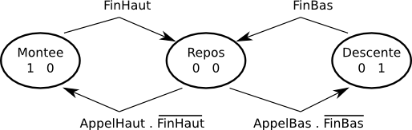

Les deux valeur notée dans chaque état corrspondent aux sorties Monte et Descend.
Il ne faut pas faire monter la cabine si elle est déjà en haut : c’est ce qui justifie la condition (AppelHaut . /Haut) pour la transition entre Repos et Montee.
Note : le point indique le ET logique (notation mathématique en algèbre de Boole).
La notation /Haut signifie que Haut est inversé. On la trouve souvent dans la documentation.
Dans le programme, les états sont identifiés par un enum et mémorisés dans une variable d’état :

	enum {Repos, Montee, Descente};
	unsigned char Etat;

La boucle principale comporte une structure switch avec un case pour chaque état. Les sorties sont assignées selon chaque état. Les transitions modifient l’état courant selon la condition associée :

	void loop () {
	  switch (Etat) {
	  case Repos :
	    Stop;
	    if (!Haut && AppelHaut) Etat = Montee;
	    if (!Bas && AppelBas) Etat = Descente;
	     break;
	  case Montee :
	    Monte;
	    if (Haut) Etat = Repos;
	    break;
	  case Descente :
	    Descend;
	    if (Bas) Etat = Repos;
	    break;
	  }
	}

Voici comment définir les entrées-sorties, en utilisant le fichier DefP2L2.def :

	// Définitions propres au monte charge :
	// - action sur les sorties :
	#define Stop {Led1Off; Led2Off;}
	#define Monte {Led1On; Led2Off;}
	#define Descend {Led1Off; Led2On;}
	// - lecture des entrées :
	#define AppelHaut Pous1On
	#define AppelBas Pous2On

Il faut encore ajouter deux entrées supplémentaires. Voici la version MSP430 :

	#define FinHaut !(P1IN & (1<<5))
	#define FinBas !(P1IN & (1<<7))

... et la version AVR (Arduino) :

	#define FinHaut !(PINB & (1<<0))
	#define FinBas !(PINB & (1<<1))

Les solutions complète avec les procédure setup() se trouvent dans Solution431.ino.
Dans Solution431C.ino, vous trouverez les versions écrites intégralement en C, sans utiliser les setup() et loop().

## *Corr 4.4-1* Dé électronique

	//Solution441.ino
	// PortC 0-3 pour allumer le dé selon schéma
	// 2   3
	// 1 0 1
	// 3   2

	void setup() {
	  DDRC = 0b0001111; // sorties
	}

	byte motifsDe [6] = {
	  0b0001,0b0100,0b1001,0b1100,0b1101,0b1110};

	void loop () {
	  int i=random (0,6); // min à max-1
	  PORTC = ~motifsDe [i] ;
	  delay (1000);
	  PORTC = ~0b0000;
	  delay (200);
	}

Deux instructions du programme principal devraient vous choquer. Que fait ce PORTC dans un programme principal, qui devient dépendant du matériel? L’opération est de copier un motif sur un port. Quel port, dire qu’il faut inverser les infomations logique pour créer le bon signal électrique n’a rien à faire ici! On doit fabriquer une fonction qui exprime ces contraintes technologique.

	void CopyMotif (mm) {
	  PORTC = ~mm ;
	}

Dans le programme, on voit alors des instructions explicites

	CopyMotif (motifsDe [i]) et CopyMotif (0);

# Semaine 5

## *Corr 5.1-1* Message Morse

On peut écrire ce programme de plusieurs façon différentes. L’important est de bien le structurer, bien séparer les définitions de l’interface lumineux/sonore et de l’application.

	//Solution512.ino Messages Morses - Test A..H
	#include "DefC2p2l.h"
	// Format Bits 7 6 5 Letter length 4 3 2 1 0 dot/dash msb first
	// Table Ascii a b c ..h codes ascii 61 62 .. 67
	byte TaMorse [] = {0x42,0x81,0x85,0x61,0x20,0x84,0x63,0x80 } ;
	#define DurDot 200 //200 ms 6mots/min
	int dot= DurDot;

	void Dot () { // point - ti
	  Led1On; delay (dot);
	  Led1Off; delay (dot);
	}
	void Dash () { // trait - ta
	  Led1On; delay (dot*3);
	  Led1Off; delay (dot);
	}
	void JoueMorse (byte cc) {
	  byte dd = cc>>5;
	  for (byte i ; i<dd; i++) {
	    if (cc&1) { Dash(); }
	    else { Dot(); }
	    cc>>=1 ;
	  }
	}

	void setup() {
	  Setup2p2l();
	  Serial.begin(9600);
	  Dash(); Dot(); Dash(); // debug
	}

	char codeRecu;
	byte indexTaMorse;
	byte codeTaMorse;
	void loop () {
	  if (Serial.available() > 0) {
	    codeRecu = Serial.read();
	  Serial.print (codeRecu,HEX); Serial.print (" ");
	    indexTaMorse = codeRecu - 'a' ;
	  Serial.print (indexTaMorse); Serial.print (" ");
	    codeTaMorse = TaMorse [indexTaMorse] ;
	  Serial.println (codeTaMorse,HEX);
	    JoueMorse (codeTaMorse);
	}

Vous remarquez que les instructions d’aide au dépannage sont toujours dans le programmes. Il faut mettre le teminal en mode "pas de fin de ligne" pour éviter le décodage du caractère fin de ligne.
On peut améliorer ce programme pour taper des mots au terminal. Tant que Serial.available est positif, on lit la lettre suivante en ajoutant l’espace entre lettres. Si on a tapé une phrase, il faut repérer les espaces pour ajouter l’espace entre mots.
Si vous avez un haut-parleur, il suffit de ré-écrire les fonctions Dot() et Dash().

## *Corr 5.4-1* Lire 4 poussoirs sur une entrée analogique

Voilà une solution, vous en avez probablemnt inventée une autre qui fonctionne.

	//Solution541.ino
	// Valeurs estimées -- a vérifier
	#define Nopous 0 ;
	#define Vpous1 205 // 1V
	#define Vpous2 410 // 2V
	#define Vpous3 614 // 3V
	#define Vpous4 819 // 4V

	void setup() {
	  Serial.begin(9600);
	  // pas nécessaire de déclare A0 en entrée
	}

	int valPous ;
	void loop () {
	  valPous = analogRead (A0) ;
	  numeroPous=0;
	  if (valPous > Vpous1 -50) numeroPous=1;
	  if (valPous > Vpous2 -50) numeroPous=2;
	  if (valPous > Vpous3 -50) numeroPous=3;
	  if (valPous > Vpous4 -50) numeroPous=4;
	  if (valPous > Vpous1 -50) {
	    Serial.print (numeroPous);
	    while (valPous < Vpous1 -50) {}
	  }
	}

**Une solution élégante**

La fonction `map` d’*Arduino* est très efficace pour cette application. On définit 4 zones entre 0.5 et 4.5 V et en une seule instruction on obtient les valeurs `1,2,3,4` que l’on peut utiliser dans un `switch..case`.

	byte numereoPous = map (AnalogRead(14),102,921,1,4)

C’est intéressant de comparer la taille des codes et les temps d’exécution.

Solution avec if : ........

SolutionMap : ........

## *Corr 5.5-1* Affichage de nombres

	//Solution551.ino
	void setup() {
	Serial.begin(9600);
	}
	void PrintBin (byte bb) {
	  for (byte i=0;i<8;i++) {
	  if (bb&0x80) Serial.print ("1");
	  else Serial.print ("0");
	  bb <<= 1;
	  }
	}

	void loop () {
	  PrintBin (17);
	  while (1) {}
	}

Pour le `PrintHex`, 2 fonctions sont préférables.

	char ConvNibble (byte nn) { // converti 4 bit hexa en Ascii
	  char cc;
	  if (nn<10) cc = nn + '0';
	  else cc = nn-10 + 'A';
	  return cc;
	}
	void PrintHex (byte hh) {
	  char cc;
	  cc = ConvNibble (hh >> 4) ; // ne modifie pas hh
	  Serial.print (cc);
	  cc = ConvNibble (hh & 0x0F) ;
	  Serial.print (cc);
	  Serial.print (" "); // cela éviter un séparateur
	}

On peut avoir besoin d’un `PrintHexInt`, `PrintHexLong` et on comprend pourquoi supprimer les _0_ non significatifs permet d’avoir une fonction d’impression qui accepte tous les types.

Une solution est de définir un `PrintHex` avec 2 paramètres, le nombre, dans un type quelconque, et le nombre de chiffre à afficher. Il suffit d’ajouter une boucle `for` dans `PrintHex` !

# Semaine 6

## *Corr 6.2-1* Dessin sur un afficheur matriciel

La routine comporte 3 boucles itératives `for`. Deux variables `x` et `y` sont utilisées pour les deux coordonnées.

	//Solution 6.2-1
	#define MaxX 16
	#define MaxY 16

	void Zoro () {
	  int x; int y;
	  for (x=0; x<MaxX; x++) { // gauche-droite en haut
	    SetPoint (x, 0);
	    Affiche (5);
	  }
	  Affiche (20); // petite attente
	  y=0;
	  for (x=MaxX-1; x>=0; x--) { // diagonale droite-gauche
	    SetPoint (x, y);
	    y++;
	    Affiche (5);
	  }
	  Affiche (20);
	  for (x=0; x<MaxX; x++) { // gauche-droite en bas
	    SetPoint (x, MaxY-1);
	    Affiche (5);
	  }
	  Affiche (1000); // attente une seconde
	  }
	}

Il serait possible d’écrire des procédures plus générales, permettant de tracer des segments de différents types, ou même des droites quelconques.

Notez que si l’afficheur est balayé, il est impossible d’utiliser un délai habituel pour programmer une attente : l’affichage serait vide durant ce temps ! Il faut appeler la procédure de raffraîchissement de la matrice.

## *Corr 6.2-2* Affichage des changements de joueur

Le système a 4 entrées (les poussoirs pour choisir les numéros) et 28 sorties (6 fois 7 segments). Attention, ne confondez pas de nombre de 28 avec les 28 LEDs sur chaque segment: on voit sur le dessin qu’un segment est composé de trois rangées de 9, 10 et 9 LEDs.

On trouve des microcontrôleurs avec un nombre suffisant de pattes pour ce projet. En boîtiers DIL 40 pattes, *Atmel* en propose (par exemple l’*ATmega32* ou ses successeurs). *Microchip* propose aussi des *PIC* avec ce type de boîtiers (comme le *16F877*). Mais ces processeurs sont “relativement” coûteux. Ils disposent aussi de “trop” de mémoire pour un si petit projet. Vous me direz que “qui peut le plus peut le moins”, c’est vrai...

La solution utilisant des registres série-parallèle est intéressante pour ce projet. En ajoutant 4 circuits *74HC595*, il n’y a besoin plus que de 4 entrées et 3 sorties. Avec l’astuce des 4 poussoirs sur une entrée analogique, les “fans” des microcontrôleurs à 8 pattes pourraient s’en sortir, par exemple avec un *ATtiny13*. Dans la série des *MSP430G*, le *2231* à 14 pattes conviendrait très bien.

L’autre problème est la commande des 28 LEDs de chaque segment. Avant de choisir le montage, il faut choisir la tension d’alimentation ! Le choix de 12 V permet d’utiliser facilement :

- des piles 1.5 V (8 piles, au format AA, ou C ou D)
- des batteries NiMH 1.2 V (10 batteries, au format AA, ou C ou D)
- une batterie au plomb 12 V (batterie de moto par exemple)

Ensuite, il faut déterminer l’architecture : 5 LEDs rouges peuvent être mises en parallèle (2 × 2 V = 10 V), mais seulement 3 LEDs vertes (3 × 3 = 9 V). On voit qu’on aura donc 5 branches de 5 LEDs rouges, plus une branche de 3 LEDs. Pour les vertes, on aura 9 branches de 3 LEDs, plus une branche avec une seule LED. C’est donc pour les LEDs vertes que le courant sera le plus important : 10 × 10 mA. Un simple transistor NPN va donc convenir (*2N3904*, *BC337*, etc.)

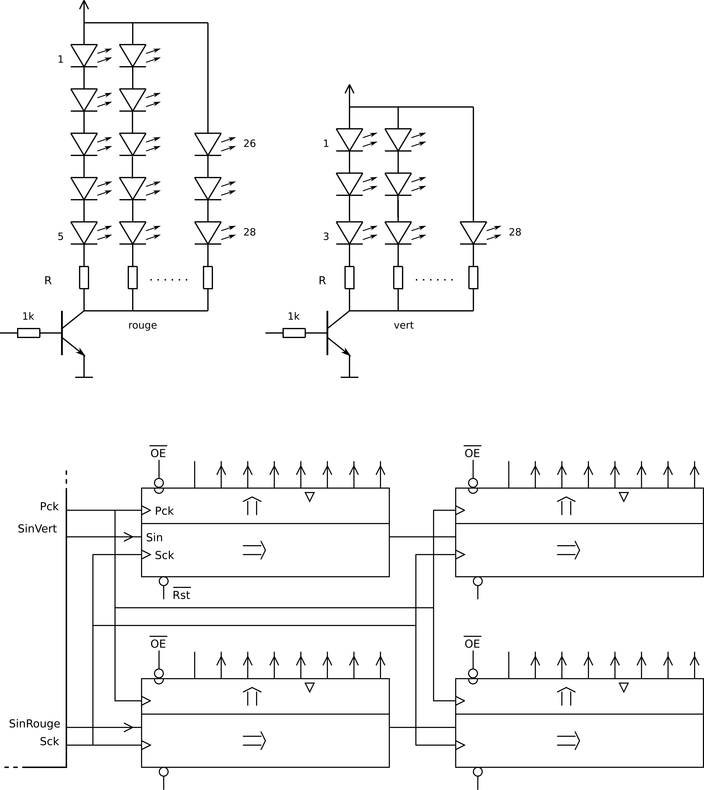

Il reste le choix des résistances. D’abord des calculs pour estimer les valeurs :

- La résistance pour les branches de 5 LEDs rouges : (12V - (5 * 2V)) / 10mA = 2/10 kΩ = 200 Ω
- La résistance pour la branche de 3 LEDs rouges : (12V - (3*2V)) / 10mA = 6/10 kΩ = 600 Ω
- La résistance pour les branches de 3 LEDs vertes : (12V - (3 * 3V)) / 10mA = 3/10 kΩ = 300 Ω
- La résistance pour la branches d’une LEDs verte : (12V - 3V) / 10mA = 9/10 kΩ = 900 Ω

Mais seule l’expérimentation avec les LEDs choisies donnera les bonnes valeurs ! D’abord, les valeurs des tensions des LED (2V et 3V) ne sont pas exactes. Mais il y a plus important : le rendement des LEDs rouges et vertes n’est pas identique. On va donc ajuster l’intensité lumineuse pour que les deux parties de l’afficheur donne une impression visuelle semblable.

## *Corr 6.3-1* Routines SPI

	//Solution631shiftOut 360us 1108 octets
	#include "DefC2p2l.h"
	#define Ld 10 // SPI SS
	#define Ck 13
	#define Mosi 11

	void setup() {
		Setup2p2l ();
		pinMode (Ld,OUTPUT);
		pinMode (Ck,OUTPUT);
		pinMode (Mosi,OUTPUT);
	}

	int data=0x1234;
	void loop () {
		for (long i=0; i<10000;i++) {
			digitalWrite(Ld, 0);
			shiftOut (Mosi,Ck,LSBFIRST,lowByte (data));
			shiftOut (Mosi,Ck,LSBFIRST,highByte (data));
			digitalWrite(Ld, 1);
		}
		Led1Toggle;
	}
	---------------
	//Solution631SPI 17us 1074 octets
	// les 2 digitalWrite font perdre 6 us
	#include "DefC2p2l.h"
	#define Ld 10 // SPI SS
	#define Ck 13
	#define Mosi 11
	#include "SPI.h"

	void setup() {
		Setup2p2l ();
		pinMode (Ld,OUTPUT);
		pinMode (Ck,OUTPUT);
		pinMode (Mosi,OUTPUT);
		SPI.begin();
		SPI.setBitOrder(LSBFIRST);
	}

	int data=0x1234;
	void loop () {
		for (long i=0; i<100000;i++) {
			digitalWrite(Ld, 0);
			SPI.transfer(lowByte (data));
			SPI.transfer(highByte (data));
			digitalWrite(Ld, 1);
		}
		Led1Toggle;
	}
	------------
	//Solution631Cdirect 18us 576 octets
	#include "DefC2p2l.h"
	#define bLd 2 // portB pin10
	#define bCk 5 // portB pin13
	#define bMosi 3 // portB pin11

	void setup() {
		Setup2p2l ();
		DDRB |= 1<}

	int data=0x1234;
	void loop () {
		data=0x1234;
		for (long i=0; i<100000;i++) {
			bitClear (PORTB,bLd);
			for (int i=0;i<16;i++) {
				if (data & 0x01) bitSet (PORTB,bMosi);
				else bitClear (PORTB,bMosi) ;
				bitSet (PORTB,bCk);
				data >>= 1; // décale et détruit data
				bitClear (PORTB,bCk); // durée 0.25 us
				data >>= 1; // détruit data
				bitClear (PORTB,bLd);
			} // end shif
		} // end repeat
		Led1Toggle;
	} // end loop

## *Corr 6.5-1* Système sur batteries

Chaque heure, le microcontrôleur va prendre à lui seul _1 mA × 1 h = 1 mAh_ dans la batterie. Le mode actif va prendre _40 mA × 1 h × (90 s / 1 h) = 1 mAh_. On a donc un courant “moyen” de _2 mA_. La durée de vie d’un jeu de piles sera donc d’envion _1300 mAh / 2 mA = 650 h_, soit moins d’un mois.

Il est intéressant de diminuer la consommation du microcontrôleur, vu qu’elle participe à la moitié de la consommation moyenne. On pourrait limiter un peu le courant consommé par le processeur en diminuant sa fréquence. Diminuer la tension semble difficile dans ce cas. La solution la plus efficace est clairement de mettre le processeur en mode “sleep”, comme expliqué dans le document [FaibleConsoDoc.pdf](http://pyr.ch/coursera/FaibleConsoDoc.pdf).

Le consommation dans ce mode où le processeur n’exécute aucune instruction est extrèmement faible, de l’ordre du µA. Il faudra alors utiliser un Timer et une interruption pour “réveiller” le processeur.

